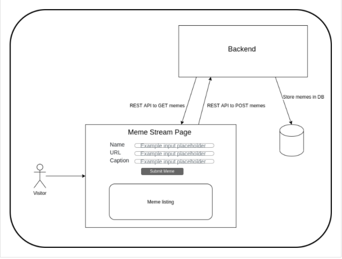

# Xmemes
<html>
<body>
<h1>Meme Stream : Spring Boot + ReactJS Application</h1>

A Full Stack meme stream application where users can post a meme by providing name,caption and an image url.
Users can also view and edit the posted memes. All the memes are displayed in a reverse chronological order on the basis of day it was posted.
The Frontend made using <b>REACTJS</b> sends all the <b>HTTP requests</b> through a <b>REST API</b> made in <b>Spring Boot</b> which further stores the meme details with name, caption and image url in a <b>MySQL database</b>.
<h2>Application Architecture</h2>

<h2>Requirements</h2>
<ul>
    <li>Node.js 14.15.5 LTS</li>
    <li>Java SDK v1.8 or higher</li>
    <li>Java 8 or higher</li>
    <li>Maven 3.3 or higher</li>
    <li>Spring Boot 2.4.2</li>
    <li>MySQL 5.6 or higher</li>
</ul>
<h2>Endpoints</h2>

    <ol type="1">
    <li>
    Endpoint to send a meme to the backend.
      <ul><li>HTTP Method - POST</li><li>Endpoint - /memes</li></ul>
    </li>
    <li>Endpoint to fetch the latest 100 memes created from the backend.
    <ul><li>HTTP Method - GET</li><li>Endpoint - /memes</li></ul>
    </li>
    <li>Endpoint to specify a particular id (identifying the meme) to fetch a single Meme.
    <ul><li>HTTP Method - GET</li><li>Endpoint - /memes/{id}</li></ul>
    </li>
    <li>Endpoint to update the caption or url for an existing meme at the backend.
    <ul><li>HTTP Method - PATCH</li><li>Endpoint - /memes/{id}</li></ul>
    </li>
    </ol>
  

<h2>Deployment</h2>

Frontend deployed through Firebase hosting : https://xmeme-aadityakhetan.web.app/

Backend Deployed at Heroku : https://xmeme-springboot-backend.herokuapp.com/memes

</body>
</html>
